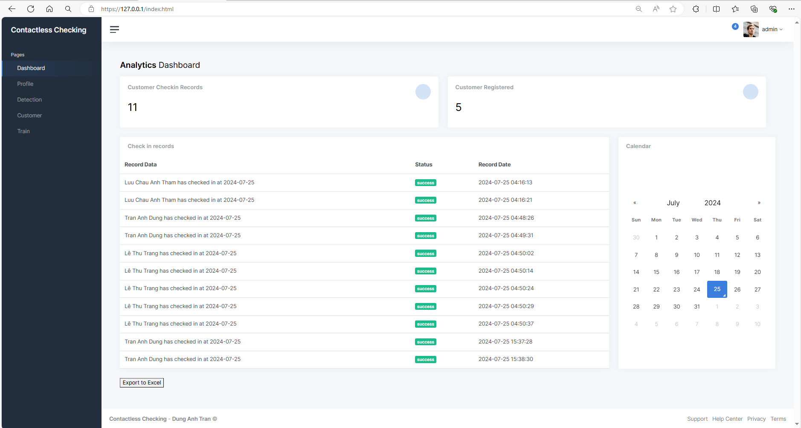
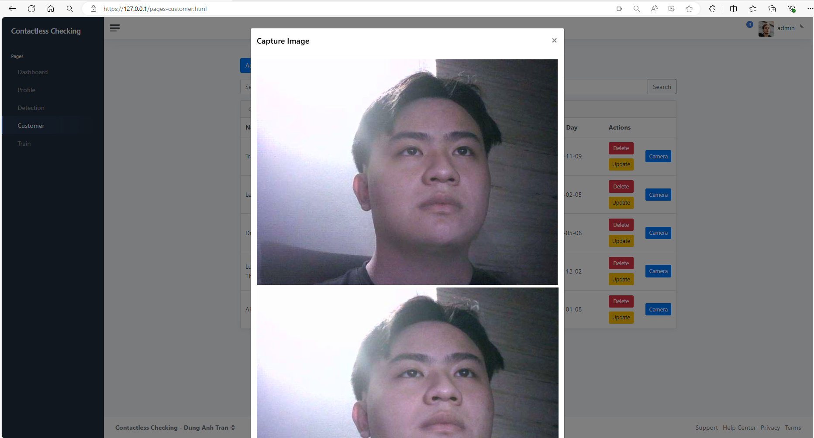

# Contactless Checking


Contacless checking repository works as client-server connection within microservices running on Kubernetes environment. This repository based on the YOLO-v8, FaceNet, ArcFace serves as checking the people registered and recognize by the system.

---
The repository using socket connection with Spring Boot web as main hosting APIs to ensure the security connection in each API request. The MYSQL database serves as a relational-database to perform query and storage datasets.

## Contents

- [Contactless Checking](#contactless-checking)
  - [Contents](#contents)
  - [Developer's Guide](#developers-guide)
    - [Getting Started](#getting-started)
      - [Development Environment](#development-environment)
      - [How to use](#how-to-use)

## Developer's Guide

### Getting Started

#### Development Environment

The recommend standard development environment is Ubuntu 18.04 LTS or later. You must install Docker, K8s Cluster Resource or minikube, Helm. 

#### How to use

1. Install docker: [docker installation](https://docs.docker.com/engine/install/ubuntu/)

    ```bash
    sudo apt-get -y update
    sudo apt-get -y upgrade
    sudo apt-get install apt-transport-https ca-certificates curl \
        gnupg-agent software-properties-common
    curl -fsSL https://download.docker.com/linux/ubuntu/gpg | sudo apt-key add -
    sudo add-apt-repository \
        "deb [arch=amd64] https://download.docker.com/linux/ubuntu \
        $(lsb_release -cs) \
        stable"
    sudo apt-get -y update
    sudo apt-get install docker-ce docker-ce-cli containerd.io
    sudo usermod -aG docker $USER
    ```

2. Install kubectl and helm in `test/install_3pp.sh`:
    ```bash
    ./install_3pp.sh
    ```
    This will automatic install kubectl and helm mount it to /usr/bin/local and make it global use.

3. Install make
    ```bash
    sudo apt install make
    ```

4. Building steps are done via make, the builders:
    - If you don't want to clean the build artifacts, run the following command
    ```bash
    make build image push
    ```
    - If you wan't to clean the build and re-run all the building steps
    ```bash
    make clean init train build image push
    ```

    The training process will take default hyper-parameters used for YOLOv8, more information, please check: [YOLOv8 ultralystics](https://github.com/ultralytics/ultralytics). The hyperparameters can be found in `vas.sh`. <br/>

    ```bash
    # Hyper parameters
    test -n "$TASK_TYPE" || export TASK_TYPE=detect #DEFAULT task=detect is one of [detect, segment, classify]
    test -n "$MODE_TYPE" || export MODE_TYPE=train #DEFAULT mode=train is one of [train, val, predict, export, track]
    test -n "$EPOCHS" || export EPOCHS=50 #DEFAULT EPOCHS=50
    test -n "$DEFAULT_MODEL" || export DEFAULT_MODEL="yolov8n.pt" #DEFAULT we get the pretrained model for training process
    test -n "$IMAGE_SIZE" || export IMAGE_SIZE=640
    ```
5. Using `testcon` image which integrate the environment for run requirement `face_model`. Check at `test/testcon`. In case you don't want to rebuild all necessary library with pip which takes a lot of efforts and time.

In order to using your docker registry. Update `DOCKER_REGISTRY` in ./vas.sh. Or simply export DOCKER_REGISTRY in your enviroment.
```bash
$ export DOCKER_REGISTRY=<your docker-registry>
```

6. Config AWS_ACCESS_KEY_ID and AWS_SECRET_ACCESS_KEY in your env to retrieve all dataset in S3 bucket. Found in IAM roles in AWS.
```bash
export AWS_ACCESS_KEY_ID=<your-AWS_ACCESS_KEY_ID>
export AWS_SECRET_ACCESS_KEY=<your-AWS_SECRET_ACCESS_KEY>
export AWS_DEFAULT_REGION=<your-AWS_DEFAULT_REGION> | <DEFAULT us-east-1>
```

7. To install helm chart, must build-image-push image to registry before running helm. If could not retrieve the image to pull.
```bash
$ EXPORT RELEASE=true
$ EXPORT NAME="-n zrdtuan-ns"
$ make package-helm
$ helm $NAME install ck-app build/helm-build/ck-application/ck-application-1.0.0-5.tgz --set aws.key=$AWS_ACCESS_KEY_ID --set aws.secret=$AWS_SECRET_ACCESS_KEY
```

For TLS, in this lab I config K8s resource in Docker Desktop => Running on WSL. To check the kubernetes IP.
```bash
$ kubectl get nodes -o wide
```
8. After install helm chart, the container will pull from docker registry to initial the pod running in k8s. Check out the deploy is up and health state.
```bash
$ kubectl $NAME get all
```

```
NAME                                                 READY   STATUS    RESTARTS   AGE
pod/ck-application-authentication-6d76dd99b7-c4xkr   1/1     Running   0          14m
pod/ck-application-client-56cd64698c-4phls           1/1     Running   0          14m
pod/ck-application-mysql-0                           2/2     Running   0          14m
pod/ck-application-server-84c4f67c6-ttn72            1/1     Running   0          14m

NAME                                    TYPE           CLUSTER-IP       EXTERNAL-IP    PORT(S)          AGE
service/ck-application-authentication   NodePort       10.106.161.1     <none>         8443:30800/TCP   14m
service/ck-application-client-http      NodePort       10.107.10.216    <none>         80:30080/TCP     14m
service/ck-application-client-https     LoadBalancer   10.101.249.249   127.0.0.1   443/TCP          14m
service/ck-application-mysql            ClusterIP      None             <none>         3306/TCP         14m
service/ck-application-mysql-read       ClusterIP      10.107.116.88    <none>         3306/TCP         14m
service/ck-application-server           NodePort       10.111.15.137    <none>         5000:30500/TCP   14m

NAME                                            READY   UP-TO-DATE   AVAILABLE   AGE
deployment.apps/ck-application-authentication   1/1     1            1           14m
deployment.apps/ck-application-client           1/1     1            1           14m
deployment.apps/ck-application-server           1/1     1            1           14m

NAME                                                       DESIRED   CURRENT   READY   AGE
replicaset.apps/ck-application-authentication-6d76dd99b7   1         1         1       14m
replicaset.apps/ck-application-client-56cd64698c           1         1         1       14m
replicaset.apps/ck-application-server-84c4f67c6            1         1         1       14m

NAME                                    READY   AGE
statefulset.apps/ck-application-mysql   1/1     14m
```

The service data will be manage and stored inside Persistent Volume Claim (PVC), in case we need to reploy the service if crashed, all the data will be preserved, and automatically mounted into pod.

9. Wait a bit untill all pods are running
```bash
NAME                                             READY   STATUS    RESTARTS   AGE
ck-application-authentication-6d76dd99b7-c4xkr   1/1     Running   0          11s
ck-application-client-56cd64698c-4phls           1/1     Running   0          11s
ck-application-mysql-0                           2/2     Running   0          11s
ck-application-server-84c4f67c6-ttn72            1/1     Running   0          11s
```

In the contactless checking system, two server are deploying alongwith one MySQL database for back up and one for primary database, and Web Client. To access into the web for user interface. We need to access into the service.

10. Get the service.
```bash
$ kubectl $NAME get svc
```
This will show all the service to access. Select the Web Client service.
```bash
NAME                            TYPE           CLUSTER-IP       EXTERNAL-IP    PORT(S)          AGE
ck-application-authentication   NodePort       10.106.161.1     <none>         8443:30800/TCP   2m49s
ck-application-client-http      NodePort       10.107.10.216    <none>         80:30080/TCP     2m49s
ck-application-client-https     LoadBalancer   10.101.249.249   127.0.0.1   443/TCP          2m49s
ck-application-mysql            ClusterIP      None             <none>         3306/TCP         2m49s
ck-application-mysql-read       ClusterIP      10.107.116.88    <none>         3306/TCP         2m49s
ck-application-server           NodePort       10.111.15.137    <none>         5000:30500/TCP   2m49s
```
Access https://127.0.0.1 or https://localhost to navigate the Web Client. If access, it will navigate to login page. All the cluster using TLS certificates to authenticate all resources.


Enter the Username/Password. By default the API Server created default Admin account. Use the credentials to login into pages.

The Homepage will show all the analytics measures, records all the checkin time filtered by date.
```bash
credentials: Admin/Admin@123
```


First, need to create a sets of customers registered in the system. Capture all images, send back to backend which stored in both local and remote S3 bucket to prevent missing data if system got crashed.


We can edit all information of customer, and make new image dataset for checking system which sent to train ArcFaceModel. To retrieve image data, we can upload images or capture the image from the camera gadget.




Those image collected will be train with Jenkins CI, enter the appropriate params and trigger to Jenkins pipeline in order to train model with datasets collected.

